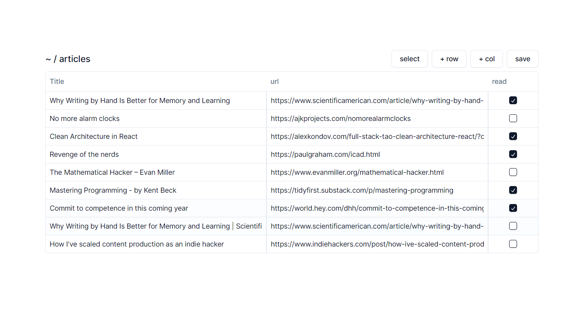

<!-- @format -->

### Tabloly

a Next.js app for the browser to save data on tables



Works locally

#### Installating

Assuming you have Node and npm setup in your environment.

1. clone the repo

```bash
git clone https://github.com/ZouicheOmar/tabloly
```

2. install dependencies

```bash
cd tabloly
npm i
npm run build
```

3. start the app

```bash
npm run start
```
